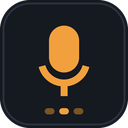

<div align="center">



# LocalDictate

**Speak freely. Type instantly. 100% private & offline.**

Free, open-source voice dictation for Chrome. Whisper runs entirely inside your browser
through Transformers.js, ONNX Runtime Web and WebGPU. Your microphone audio never leaves
your machine — there is no server to send it to.

[](LICENSE)
[](https://developer.chrome.com/docs/extensions/mv3/intro/)
[](https://developer.chrome.com/docs/web-platform/webgpu/)
[](PRIVACY.md)

[Install](#install) · [How it works](#how-it-works) · [Build from source](#build-from-source) · [Contributing](CONTRIBUTING.md) · [Privacy](PRIVACY.md)

</div>

---

## What it does

Put your caret in any text field on any site, press `Ctrl+Shift+D`, and talk. The words
appear where the caret is — in Gmail, Notion, Slack, GitHub issues, a Jira ticket, a
search box, a `<textarea>` on a form nobody has updated since 2011.

Everything happens locally. The only network request LocalDictate ever makes is the
one-time model download from Hugging Face. After that you can turn off Wi-Fi and keep
dictating.

<div align="center">

<!-- Screenshots: replace these placeholders with real captures. See store/screenshots/README.md -->


<sub>Left: the popup transport panel. Right: the in-page listening bar.</sub>

</div>

---

## Features

| | |
|---|---|
| **Whisper, on device** | Tiny, Base and Small, converted to ONNX and quantised for the browser. |
| **WebGPU with a real fallback** | Detects an adapter and uses it; drops to WebAssembly automatically, and tells you which one is running. |
| **Near real-time** | Utterances are segmented by voice activity detection and decoded as you pause, with streaming partials in between. |
| **Types where you're typing** | Native value setters for inputs, `insertText` for contenteditable, clipboard fallback for canvas editors. |
| **Silence never reaches the model** | An energy gate with an adaptive noise floor throws away room tone before it costs you any compute. |
| **Clean output** | Fillers removed, sentences capitalised, punctuation spaced. Spoken commands — "new paragraph", "comma", "question mark" — work out of the box. |
| **Your vocabulary** | Word replacements for names and acronyms Whisper mangles. |
| **Cached and offline** | Weights live in IndexedDB. Second launch is instant and needs no connection. |
| **Yours to inspect** | MIT licensed, no build obfuscation, no analytics, no accounts. |

---

## Install

### From the Chrome Web Store

> Coming soon — the listing is in review. Until then, load it unpacked.

### Load unpacked (any Chromium browser, Chrome 116+)

```bash
git clone https://github.com/wushu75/LocalDictate.git
cd LocalDictate
npm install     # fetches Transformers.js + ONNX Runtime Web
npm run build   # copies them into lib/
```

1. Open `chrome://extensions`.
2. Turn on **Developer mode** (top right).
3. Click **Load unpacked** and select the `LocalDictate` folder.
4. A welcome tab opens. Grant microphone access, then download a model.

The `lib/` folder is intentionally not committed — it holds upstream build artefacts.
`npm run build` is what puts them there, and the extension will not start without it.

---

## First run

1. **Grant the microphone.** Chrome asks once, for the extension itself.
2. **Pick a model.** Base is the right first choice. Tiny if you are on an old laptop,
   Small if you have a discrete GPU and care about accuracy.
3. **Wait for the download.** 78 MB to 490 MB depending on the model, once, ever.
4. **Click into a text field and press `Ctrl+Shift+D`.**

Prefer holding a key? Settings → Dictation → Trigger → *Push to talk*. The default hold
key is Right Ctrl, and you can rebind it to anything.

---

## How it works

```
┌───────────────┐   hotkey    ┌──────────────────┐
│ content script│────────────▶│ service worker   │  routes, never touches audio
│ focus + HUD   │◀────────────│                  │
└───────────────┘   text      └────────┬─────────┘
        ▲                              │ chrome.offscreen
        │ insertText                   ▼
        │                     ┌──────────────────────────────┐
        │                     │ offscreen document           │
        │                     │  getUserMedia → AudioWorklet │
        │                     │  16 kHz mono → VAD → segments│
        │                     └───────────┬──────────────────┘
        │                                 │ Float32Array (transferred)
        │                                 ▼
        │                     ┌──────────────────────────────┐
        └─────────────────────│ module worker                │
                              │  Transformers.js + ORT Web   │
                              │  Whisper on WebGPU or WASM   │
                              └──────────────────────────────┘
```

**Why an offscreen document?** MV3 service workers can't hold a `MediaStream` or an
`AudioContext`, and they get torn down mid-sentence. The offscreen document owns the
capture graph and the worker; the service worker only routes messages.

**Why a separate worker for inference?** Decoding a 20-second utterance on WASM can block
a thread for seconds. Keeping it off the document's main thread keeps the level meter and
the HUD responsive while Whisper works.

**Segmentation.** Audio arrives as 1024-sample frames (64 ms). Each frame gets an RMS
measurement against an adaptive noise floor. Speech opens an utterance; 700 ms of silence
closes it and sends it for a final decode. While an utterance is open, a partial decode
runs every ~1.4 s so you can see the words forming.

More detail in [`docs/ARCHITECTURE.md`](docs/ARCHITECTURE.md).

---

## Performance

Rough figures for one 8-second utterance, measured end to end on a 2023 laptop. Yours
will differ; the ratios are what matter.

| Model | WebGPU | WASM (CPU) | Download |
|---|---|---|---|
| Tiny | ~0.4 s | ~1.6 s | ~78 MB |
| Base | ~0.7 s | ~3.4 s | ~148 MB |
| Small | ~1.8 s | ~11 s | ~490 MB |

The first utterance after loading is slower — that's shader and graph compilation. It
happens once per session, and LocalDictate runs a silent warm-up pass to absorb most of it.

---

## Build from source

```bash
npm install          # dependencies
npm run vendor       # copy transformers.js + ort wasm into lib/
npm run icons        # regenerate icons/*.png from scripts/make-icons.py (needs Pillow)
npm run package      # produce dist/localdictate-<version>.zip for the Web Store
npm run clean        # remove dist/ and vendored lib files
```

There is no bundler and no transpiler. Every file you read in `src/` is the file the
browser runs, which is the point: a privacy tool should be auditable without a build
graph in the way.

---

## Repository layout

```
LocalDictate/
├── manifest.json                 Manifest V3
├── icons/                        16 / 32 / 48 / 128 / 512 px + SVG source
├── lib/                          vendored (git-ignored, created by npm run build)
│   ├── transformers.js
│   └── ort/                      onnxruntime-web wasm binaries
├── src/
│   ├── background/service-worker.js   hotkeys, offscreen lifecycle, routing
│   ├── offscreen/                     mic capture, VAD, worker orchestration
│   │   ├── offscreen.html
│   │   ├── offscreen.js
│   │   └── pcm-processor.js           AudioWorklet
│   ├── worker/whisper-worker.js       Transformers.js pipeline
│   ├── content/                       focus tracking, HUD, text insertion
│   ├── popup/                         transport panel, model picker, transcript
│   ├── options/                       full settings
│   ├── permission/                    microphone grant + onboarding
│   └── common/                        constants, storage, VAD, post-processing, cache
├── scripts/                      vendor, package, icon generation
├── store/                        Chrome Web Store listing copy and assets
└── docs/                         architecture notes and screenshots
```

---

## Privacy

The short version: **no audio, no transcripts and no usage data ever leave your device.**
There is no backend, no account, no analytics SDK and no remote logging in this codebase.

The one network request is the model download from `huggingface.co`, declared in
`host_permissions`. It happens once per model and is cached in IndexedDB.

Full statement: [PRIVACY.md](PRIVACY.md). If you find anything in this repository that
contradicts it, that is a security bug — please open an issue immediately.

---

## Troubleshooting

**Nothing appears in the page.** Click into the field first. LocalDictate types into the
element that had focus when you started. If the site uses a canvas editor (Google Docs),
the text is copied to your clipboard instead and a toast tells you to paste.

**Google Docs.** Docs renders text on a canvas with no real editable DOM. No extension can
type into it directly. Use the clipboard fallback, or dictate in the comment box, which is
a normal contenteditable.

**"WebGPU is unavailable."** You're on WASM. It works, it's just slower — stick to Tiny or
Base. Chrome exposes WebGPU on most modern hardware; check `chrome://gpu`.

**The first sentence is missing words.** Voice activity detection needs ~160 ms of speech
to open an utterance. Lower the sensitivity slider, or use push-to-talk, which ignores the
gate while the key is held.

**It's transcribing my music / air conditioner.** Raise the sensitivity slider. Whisper
will happily hallucinate lyrics into silence; the gate is what prevents that.

**Model download stalls.** Hugging Face rate-limits occasionally. Delete the partial
download in Settings → Storage & privacy, then retry.

---

## Contributing

Issues and pull requests are welcome — see [CONTRIBUTING.md](CONTRIBUTING.md). Good first
contributions:

- Better VAD (a Silero ONNX gate would beat the energy heuristic)
- Per-site insertion adapters for editors that resist `insertText`
- Translation of the UI strings
- Streaming decode that emits words while you're still speaking, not on pause
- Distil-Whisper and Whisper-Turbo support

## Credits

Built on [Transformers.js](https://github.com/huggingface/transformers.js) by Hugging Face,
[ONNX Runtime Web](https://onnxruntime.ai/) by Microsoft, and
[Whisper](https://github.com/openai/whisper) by OpenAI. ONNX conversions from the
[onnx-community](https://huggingface.co/onnx-community) organisation.

## License

[MIT](LICENSE) © LocalDictate contributors.

<div align="center">
<sub>If LocalDictate saves you some typing, a star costs nothing and helps other people find it.</sub>
</div>
